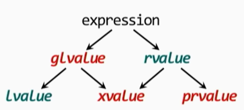

# Setup
`start_hep_container` or

```bash
TRITON_IMAGE="docker.io/docexoty/heptools:ubuntu20.04"
podman-hpc run -it --rm --ipc=host --net=host --ulimit memlock=-1 --ulimit stack=67108864 -v $PWD:$PWD -w $PWD $TRITON_IMAGE bash
```
# Understanding Value Categories



In C++, an expression contains a *type* and a *value*.
There are two kinds of values:
* *lvalue*, which occupy data storage and can be assigned to
    * non-modifiable *lvalue*, which occupy data storage but cannot be assigned to
* (non-class) *rvalue*, which does not occupy data storage and cannot be assigned to

In the example expression, `int i; i = 5;`, `i` is a `lvalue` and `5` is a `rvalue`.

There are two kinds of *rvalues*:
* *prvalues*, "pure rvalues", which don't occupy data storage
* *xvalues*, "Expiring values", which do

A *glvalue* is either a *lvalue* or *xvalue*, namely, "generalized lvalue".

## Temporary materialization conversion
In this example, `double const &rd = 12;` the following happens:
* the *rvalue* 12 is converted to a *xvalue* `double`.
* compiler creates a temporary `double` to hold the converted result, and
* it binds `rd` to the temporary.

## References
What C++03 calls "references", C++11 calls *lvalue references*, like `int &ri;`.
This distinguishes them from C++11's new *rvalue references*, like `int &&ri = 10;` or `double &&f(int &&ri);`.

Binding an "rvalue reference" to an rvalue triggers a temporary materialization conversion.
Modern C++ uses rvalue references to implement *move* operations that can avoid uncessary copying.
For example, in this expression `string s1, s2, s3; s1 = s2 + s3;`,
the compiler can use move semantics (`string::operator=(string &&)`)
to avoid copying the result of `s2 + s3` into `s1`.

That a *lvalue* becoming an *xvalue* often happens in a `return` statement.
